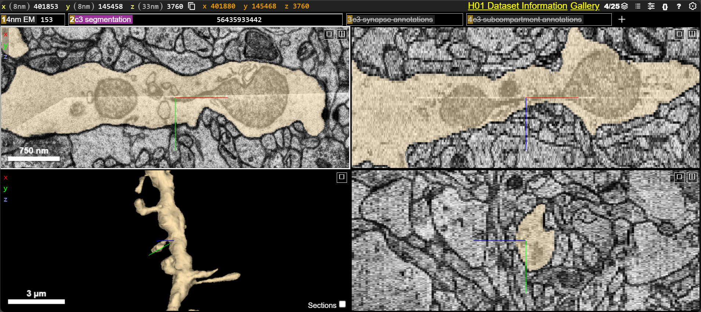

# h01-volume

Reconstructions and analyses from the Lichtman laboratory at Harvard University and Connectomics group at Google [H01](https://h01-release.storage.googleapis.com/landing.html) human cortex serial EM volume.

**Attribution and data:** https://h01-release.storage.googleapis.com/data.html 
**Citation:** https://h01-release.storage.googleapis.com/paper.html 

***

### View [notebook](https://github.com/shandran/h01-volume/tree/main/notebooks) folder for analysis and visualization tools

***

### Fission between two mitochondria

#### View in [Neuroglancer](https://h01-dot-neuroglancer-demo.appspot.com/#!%7B%22dimensions%22:%7B%22x%22:%5B8e-9%2C%22m%22%5D%2C%22y%22:%5B8e-9%2C%22m%22%5D%2C%22z%22:%5B3.3e-8%2C%22m%22%5D%7D%2C%22position%22:%5B401853.09375%2C145458.5%2C3760.5%5D%2C%22crossSectionScale%22:1.040075246459179%2C%22projectionOrientation%22:%5B-0.5142304301261902%2C0.8109516501426697%2C0.15366007387638092%2C0.23305165767669678%5D%2C%22projectionScale%22:1858.3195083692322%2C%22layers%22:%5B%7B%22type%22:%22image%22%2C%22source%22:%22precomputed://gs://h01-release/data/20210601/4nm_raw%22%2C%22tab%22:%22source%22%2C%22name%22:%224nm%20EM%22%7D%2C%7B%22type%22:%22segmentation%22%2C%22source%22:%7B%22url%22:%22precomputed://gs://h01-release/data/20210601/c3%22%2C%22subsources%22:%7B%22default%22:true%2C%22bounds%22:true%2C%22properties%22:true%2C%22mesh%22:true%7D%2C%22enableDefaultSubsources%22:false%7D%2C%22tab%22:%22segments%22%2C%22segments%22:%5B%2256435933442%22%5D%2C%22segmentQuery%22:%2256435933442%22%2C%22colorSeed%22:2002621183%2C%22name%22:%22c3%20segmentation%22%7D%2C%7B%22type%22:%22annotation%22%2C%22source%22:%22precomputed://gs://h01-release/data/20210729/c3/synapses/precomputed%22%2C%22tab%22:%22source%22%2C%22ignoreNullSegmentFilter%22:false%2C%22shader%22:%22void%20main%28%29%20%7B%5Cn%20%20if%20%28prop_type%28%29%20==%20uint%281%29%29%20%7B%5Cn%20%20%20%20setColor%28vec3%280.%2C0.%2C1.%29%29%3B%5Cn%20%20%7D%20else%20%7B%5Cn%20%20%20%20setColor%28vec3%281.%2C1.%2C0.%29%29%3B%5Cn%20%20%7D%5Cn%20%20%5Cn%20%20setEndpointMarkerBorderWidth%280.0%29%3B%5Cn%20%20setEndpointMarkerSize%284.0%29%3B%5Cn%7D%5Cn%22%2C%22linkedSegmentationLayer%22:%7B%22post_synaptic_cell%22:%22c3%20segmentation%22%7D%2C%22filterBySegmentation%22:%5B%22post_synaptic_cell%22%5D%2C%22name%22:%22c3%20synapse%20annotations%22%2C%22visible%22:false%7D%2C%7B%22type%22:%22annotation%22%2C%22source%22:%22precomputed://gs://h01-release/data/20210601/c3/subcompartments/annotations%22%2C%22tab%22:%22source%22%2C%22ignoreNullSegmentFilter%22:false%2C%22shader%22:%22void%20main%28%29%20%7B%5Cn%20%20switch%20%28prop_class_label%28%29%29%20%7B%5Cn%20%20case%200:%20%20//%20axon%5Cn%20%20%20%20setColor%28vec3%280%2C%200%2C%201%29%29%3B%5Cn%20%20%20%20break%3B%5Cn%20%20case%201:%20%20//%20dendrite%5Cn%20%20%20%20setColor%28vec3%281%2C%200%2C%200%29%29%3B%5Cn%20%20%20%20break%3B%5Cn%20%20case%202:%20%20//%20astrocyte%5Cn%20%20%20%20setColor%28vec3%280%2C%201%2C%200%29%29%3B%5Cn%20%20%20%20break%3B%5Cn%20%20case%203:%20%20//%20soma%5Cn%20%20%20%20setColor%28vec3%281%2C%201%2C%201%29%29%3B%5Cn%20%20%20%20break%3B%5Cn%20%20case%204:%20%20//%20cilium%5Cn%20%20%20%20setColor%28vec3%280.5%2C%200.5%2C%200%29%29%3B%5Cn%20%20%20%20break%3B%5Cn%20%20case%205:%20%20//%20AIS%5Cn%20%20%20%20setColor%28vec3%280.5%2C%200.5%2C%201%29%29%3B%5Cn%20%20%20%20break%3B%5Cn%20%20%20%20%5Cn%20%20case%201000:%20%20//%20myelinated%20axon%5Cn%20%20case%201001:%5Cn%20%20%20%20setColor%28vec3%281%2C%200.25%2C%200.75%29%29%3B%5Cn%20%20%20%20break%3B%5Cn%20%20case%201004:%20%20//%20fragments%5Cn%20%20case%201005:%5Cn%20%20default:%5Cn%20%20%20%20discard%3B%5Cn%20%20%7D%5Cn%7D%22%2C%22linkedSegmentationLayer%22:%7B%22skeleton_id%22:%22c3%20segmentation%22%7D%2C%22filterBySegmentation%22:%5B%22skeleton_id%22%5D%2C%22name%22:%22c3%20subcompartment%20annotations%22%2C%22visible%22:false%7D%2C%7B%22type%22:%22segmentation%22%2C%22source%22:%22precomputed://gs://h01-release/data/20210729/c3/synapses/incoming_excitatory%22%2C%22tab%22:%22source%22%2C%22linkedSegmentationGroup%22:%22c3%20segmentation%22%2C%22linkedSegmentationColorGroup%22:false%2C%22colorSeed%22:2613304347%2C%22segmentDefaultColor%22:%22#ffff00%22%2C%22name%22:%22c3%20incoming%20excitatory%22%2C%22archived%22:true%7D%2C%7B%22type%22:%22segmentation%22%2C%22source%22:%22precomputed://gs://h01-release/data/20210729/c3/synapses/incoming_inhibitory%22%2C%22tab%22:%22source%22%2C%22linkedSegmentationGroup%22:%22c3%20segmentation%22%2C%22linkedSegmentationColorGroup%22:false%2C%22colorSeed%22:679993271%2C%22segmentDefaultColor%22:%22#0000ff%22%2C%22name%22:%22c3%20incoming%20inhibitory%22%2C%22archived%22:true%7D%2C%7B%22type%22:%22annotation%22%2C%22source%22:%22precomputed://gs://h01-release/data/20210601/c3/embeddings/combined_umap%22%2C%22tab%22:%22source%22%2C%22shader%22:%22void%20main%28%29%20%7B%5Cn%20%20setColor%28vec3%28%5Cn%20%20%20%201.0%20-%20%28prop_ue0%28%29%20+%204.6017108%29%20/%2018.7%2C%20%5Cn%20%20%20%201.0%20-%20%28prop_ue1%28%29%20+%200.13594195%20%29/%209.28%2C%20%5Cn%20%20%20%20%28prop_ue2%28%29%20-%206.69197893%29%20/%207.59%29%29%3B%20%5Cn%20%20setPointMarkerBorderColor%28vec3%28%5Cn%20%20%20%201.0%20-%20%28prop_ue0%28%29%20+%204.6017108%29%20/%2018.7%2C%20%5Cn%20%20%20%201.0%20-%20%28prop_ue1%28%29%20+%200.13594195%20%29/%209.28%2C%20%5Cn%20%20%20%20%28prop_ue2%28%29%20-%206.69197893%29%20/%207.59%29%29%3B%20%5Cn%20%20setPointMarkerSize%285.0%29%3B%5Cn%20%20setPointMarkerBorderWidth%280.%29%3B%5Cn%7D%22%2C%22linkedSegmentationLayer%22:%7B%22skeleton_id%22:%22c3%20segmentation%22%7D%2C%22filterBySegmentation%22:%5B%22skeleton_id%22%5D%2C%22name%22:%22c3%20embeddings%22%2C%22archived%22:true%7D%2C%7B%22type%22:%22annotation%22%2C%22source%22:%22precomputed://gs://h01-release/data/20210601/c3/subcompartments/annotations/cilia%22%2C%22tab%22:%22source%22%2C%22projectionAnnotationSpacing%22:1.3607900001743771%2C%22shader%22:%22void%20main%28%29%20%7B%5Cn%20%20switch%20%28prop_class_label%28%29%29%20%7B%5Cn%20%20case%200:%20%20//%20axon%5Cn%20%20%20%20setColor%28vec3%280%2C%200%2C%201%29%29%3B%5Cn%20%20%20%20break%3B%5Cn%20%20case%201:%20%20//%20dendrite%5Cn%20%20%20%20setColor%28vec3%281%2C%200%2C%200%29%29%3B%5Cn%20%20%20%20break%3B%5Cn%20%20case%202:%20%20//%20astrocyte%5Cn%20%20%20%20setColor%28vec3%280%2C%201%2C%200%29%29%3B%5Cn%20%20%20%20break%3B%5Cn%20%20case%203:%20%20//%20soma%5Cn%20%20%20%20setColor%28vec3%281%2C%201%2C%201%29%29%3B%5Cn%20%20%20%20break%3B%5Cn%20%20case%204:%20%20//%20cilium%5Cn%20%20%20%20setColor%28vec3%280.5%2C%200.5%2C%200%29%29%3B%5Cn%20%20%20%20break%3B%5Cn%20%20case%205:%20%20//%20AIS%5Cn%20%20%20%20setColor%28vec3%280.5%2C%200.5%2C%201%29%29%3B%5Cn%20%20%20%20break%3B%5Cn%20%20%20%20%5Cn%20%20case%201000:%20%20//%20myelinated%20axon%5Cn%20%20case%201001:%5Cn%20%20%20%20setColor%28vec3%281%2C%200.25%2C%200.75%29%29%3B%5Cn%20%20%20%20break%3B%5Cn%20%20case%201004:%20%20//%20fragments%5Cn%20%20case%201005:%5Cn%20%20default:%5Cn%20%20%20%20discard%3B%5Cn%20%20%7D%5Cn%7D%22%2C%22name%22:%22c3%20cilia%20annotations%22%2C%22archived%22:true%7D%2C%7B%22type%22:%22annotation%22%2C%22source%22:%22precomputed://gs://h01-release/data/20210601/c3/subcompartments/annotations/ais%22%2C%22tab%22:%22source%22%2C%22projectionAnnotationSpacing%22:0.14324743353719752%2C%22shader%22:%22void%20main%28%29%20%7B%5Cn%20%20switch%20%28prop_class_label%28%29%29%20%7B%5Cn%20%20case%200:%20%20//%20axon%5Cn%20%20%20%20setColor%28vec3%280%2C%200%2C%201%29%29%3B%5Cn%20%20%20%20break%3B%5Cn%20%20case%201:%20%20//%20dendrite%5Cn%20%20%20%20setColor%28vec3%281%2C%200%2C%200%29%29%3B%5Cn%20%20%20%20break%3B%5Cn%20%20case%202:%20%20//%20astrocyte%5Cn%20%20%20%20setColor%28vec3%280%2C%201%2C%200%29%29%3B%5Cn%20%20%20%20break%3B%5Cn%20%20case%203:%20%20//%20soma%5Cn%20%20%20%20setColor%28vec3%281%2C%201%2C%201%29%29%3B%5Cn%20%20%20%20break%3B%5Cn%20%20case%204:%20%20//%20cilium%5Cn%20%20%20%20setColor%28vec3%280.5%2C%200.5%2C%200%29%29%3B%5Cn%20%20%20%20break%3B%5Cn%20%20case%205:%20%20//%20AIS%5Cn%20%20%20%20setColor%28vec3%280.5%2C%200.5%2C%201%29%29%3B%5Cn%20%20%20%20break%3B%5Cn%20%20%20%20%5Cn%20%20case%201000:%20%20//%20myelinated%20axon%5Cn%20%20case%201001:%5Cn%20%20%20%20setColor%28vec3%281%2C%200.25%2C%200.75%29%29%3B%5Cn%20%20%20%20break%3B%5Cn%20%20case%201004:%20%20//%20fragments%5Cn%20%20case%201005:%5Cn%20%20default:%5Cn%20%20%20%20discard%3B%5Cn%20%20%7D%5Cn%7D%22%2C%22name%22:%22c3%20AIS%20annotations%22%2C%22archived%22:true%7D%2C%7B%22type%22:%22segmentation%22%2C%22source%22:%22precomputed://gs://h01-release/data/20210601/c3/subcompartments%22%2C%22tab%22:%22source%22%2C%22segments%22:%5B%5D%2C%22segmentColors%22:%7B%22100%22:%22#0000ff%22%2C%22101%22:%22#ff0000%22%2C%22102%22:%22#00ff00%22%2C%22103%22:%22#ffffff%22%2C%22104%22:%22#7f7f00%22%2C%22105%22:%22#7f7fff%22%2C%221100%22:%22#ff3fbf%22%2C%221101%22:%22#ff3fbf%22%2C%221102%22:%22#000000%22%2C%221103%22:%22#000000%22%2C%221104%22:%22#ff3fbf%22%2C%221105%22:%22#ff3fbf%22%7D%2C%22name%22:%22c3%20subcompartments%20render%22%2C%22archived%22:true%7D%2C%7B%22type%22:%22segmentation%22%2C%22source%22:%7B%22url%22:%22precomputed://gs://h01-release/data/20210601/proofread_104%22%2C%22subsources%22:%7B%22default%22:true%2C%22bounds%22:true%2C%22properties%22:true%2C%22mesh%22:true%7D%2C%22enableDefaultSubsources%22:false%7D%2C%22tab%22:%22source%22%2C%22segments%22:%5B%221072605926%22%2C%221304599410%22%2C%221465400601%22%2C%221669770671%22%2C%221684504313%22%2C%221787105373%22%2C%221830470325%22%2C%221874244336%22%2C%221900905433%22%2C%221930502394%22%2C%222001418787%22%2C%222047644309%22%2C%222074305737%22%2C%222103991145%22%2C%222104047922%22%2C%222195261734%22%2C%222252715458%22%2C%222306214824%22%2C%222325998949%22%2C%222451406889%22%2C%222530864375%22%2C%222820958695%22%2C%222848552900%22%2C%222888180252%22%2C%222889815798%22%2C%222903686765%22%2C%223093748739%22%2C%223111823553%22%2C%223139317430%22%2C%223178243558%22%2C%223329117097%22%2C%223383650350%22%2C%223432315514%22%2C%223470629528%22%2C%223503540481%22%2C%223519995546%22%2C%223571083397%22%2C%223680152874%22%2C%223751392341%22%2C%223761379470%22%2C%223812058320%22%2C%223836078296%22%2C%223954491075%22%2C%223955003482%22%2C%224010150634%22%2C%224039221194%22%2C%224125702786%22%2C%224138580687%22%2C%224157825456%22%2C%224188575291%22%2C%224197933517%22%2C%224260528559%22%2C%224365276903%22%2C%224420044370%22%2C%224437316933%22%2C%224467761196%22%2C%224476359994%22%2C%224522237537%22%2C%224535129012%22%2C%224554213569%22%2C%224582188328%22%2C%224607885827%22%2C%224641147055%22%2C%224668874666%22%2C%224711567524%22%2C%224711641825%22%2C%224830551047%22%2C%224853956860%22%2C%224873639924%22%2C%224932057570%22%2C%225013648003%22%2C%225015035926%22%2C%225060444657%22%2C%225061320552%22%2C%225136107765%22%2C%225173982155%22%2C%225175880292%22%2C%225215113731%22%2C%225216806368%22%2C%225319188363%22%2C%225352961465%22%2C%225355296383%22%2C%225439194879%22%2C%22546925828%22%2C%22547114083%22%2C%225536146025%22%2C%225584343344%22%2C%225654281423%22%2C%225687162964%22%2C%225805562981%22%2C%225832764277%22%2C%225965472721%22%2C%226126390733%22%2C%22620880207%22%2C%22678539249%22%2C%226833911543%22%2C%227052969349%22%2C%227196644737%22%2C%22751294744%22%2C%227893125555%22%2C%22810151953%22%2C%22810970127%22%2C%22883843993%22%2C%22955432427%22%5D%2C%22name%22:%22proofread%20104%20cells%22%2C%22archived%22:true%7D%2C%7B%22type%22:%22annotation%22%2C%22source%22:%22precomputed://gs://h01-release/data/20210601/proofread_104/subcompartments/annotations%22%2C%22tab%22:%22annotations%22%2C%22ignoreNullSegmentFilter%22:false%2C%22shader%22:%22void%20main%28%29%20%7B%5Cn%20%20switch%20%28prop_class_label%28%29%29%20%7B%5Cn%20%20case%200:%20%20//%20axon%5Cn%20%20%20%20setColor%28vec3%280%2C%200%2C%201%29%29%3B%5Cn%20%20%20%20break%3B%5Cn%20%20case%201:%20%20//%20dendrite%5Cn%20%20%20%20setColor%28vec3%281%2C%200%2C%200%29%29%3B%5Cn%20%20%20%20break%3B%5Cn%20%20case%202:%20%20//%20astrocyte%5Cn%20%20%20%20setColor%28vec3%280%2C%201%2C%200%29%29%3B%5Cn%20%20%20%20break%3B%5Cn%20%20case%203:%20%20//%20soma%5Cn%20%20%20%20setColor%28vec3%281%2C%201%2C%201%29%29%3B%5Cn%20%20%20%20break%3B%5Cn%20%20case%204:%20%20//%20cilium%5Cn%20%20%20%20setColor%28vec3%280.5%2C%200.5%2C%200%29%29%3B%5Cn%20%20%20%20break%3B%5Cn%20%20case%205:%20%20//%20AIS%5Cn%20%20%20%20setColor%28vec3%280.5%2C%200.5%2C%201%29%29%3B%5Cn%20%20%20%20break%3B%5Cn%20%20%20%20%5Cn%20%20case%201000:%20%20//%20myelinated%20axon%5Cn%20%20case%201001:%5Cn%20%20%20%20setColor%28vec3%281%2C%200.25%2C%200.75%29%29%3B%5Cn%20%20%20%20break%3B%5Cn%20%20case%201004:%20%20//%20fragments%5Cn%20%20case%201005:%5Cn%20%20default:%5Cn%20%20%20%20discard%3B%5Cn%20%20%7D%5Cn%7D%22%2C%22filterBySegmentation%22:%5B%22skeleton_id%22%5D%2C%22name%22:%22proofread104%20subcompartment%20annotations%22%2C%22archived%22:true%7D%2C%7B%22type%22:%22segmentation%22%2C%22source%22:%7B%22url%22:%22precomputed://gs://h01-release/data/20210601/c2%22%2C%22subsources%22:%7B%22default%22:true%2C%22bounds%22:true%2C%22properties%22:true%2C%22mesh%22:true%7D%2C%22enableDefaultSubsources%22:false%7D%2C%22tab%22:%22source%22%2C%22segments%22:%5B%5D%2C%22colorSeed%22:4270253886%2C%22name%22:%22c2%20segmentation%22%2C%22archived%22:true%7D%2C%7B%22type%22:%22annotation%22%2C%22source%22:%22precomputed://gs://h01-release/data/20210601/c2/synapses/precomputed%22%2C%22tab%22:%22source%22%2C%22ignoreNullSegmentFilter%22:false%2C%22shader%22:%22void%20main%28%29%20%7B%5Cn%20%20if%20%28prop_type%28%29%20==%20uint%281%29%29%20%7B%5Cn%20%20%20%20setColor%28vec3%280.%2C0.%2C1.%29%29%3B%5Cn%20%20%7D%20else%20%7B%5Cn%20%20%20%20setColor%28vec3%281.%2C1.%2C0.%29%29%3B%5Cn%20%20%7D%5Cn%20%20%5Cn%20%20setEndpointMarkerBorderWidth%280.0%29%3B%5Cn%20%20setEndpointMarkerSize%284.0%29%3B%5Cn%7D%5Cn%22%2C%22linkedSegmentationLayer%22:%7B%22post_synaptic_cell%22:%22c2%20segmentation%22%7D%2C%22filterBySegmentation%22:%5B%22post_synaptic_cell%22%5D%2C%22name%22:%22c2%20synapse%20annotations%22%2C%22archived%22:true%7D%2C%7B%22type%22:%22annotation%22%2C%22source%22:%22precomputed://gs://h01-release/data/20210601/c2/subcompartments/annotations%22%2C%22tab%22:%22source%22%2C%22ignoreNullSegmentFilter%22:false%2C%22shader%22:%22void%20main%28%29%20%7B%5Cn%20%20switch%20%28prop_class_label%28%29%29%20%7B%5Cn%20%20case%200:%20%20//%20axon%5Cn%20%20%20%20setColor%28vec3%280%2C%200%2C%201%29%29%3B%5Cn%20%20%20%20break%3B%5Cn%20%20case%201:%20%20//%20dendrite%5Cn%20%20%20%20setColor%28vec3%281%2C%200%2C%200%29%29%3B%5Cn%20%20%20%20break%3B%5Cn%20%20case%202:%20%20//%20astrocyte%5Cn%20%20%20%20setColor%28vec3%280%2C%201%2C%200%29%29%3B%5Cn%20%20%20%20break%3B%5Cn%20%20case%203:%20%20//%20soma%5Cn%20%20%20%20setColor%28vec3%281%2C%201%2C%201%29%29%3B%5Cn%20%20%20%20break%3B%5Cn%20%20case%204:%20%20//%20cilium%5Cn%20%20%20%20setColor%28vec3%280.5%2C%200.5%2C%200%29%29%3B%5Cn%20%20%20%20break%3B%5Cn%20%20case%205:%20%20//%20AIS%5Cn%20%20%20%20setColor%28vec3%280.5%2C%200.5%2C%201%29%29%3B%5Cn%20%20%20%20break%3B%5Cn%20%20%20%20%5Cn%20%20case%201000:%20%20//%20myelinated%20axon%5Cn%20%20case%201001:%5Cn%20%20%20%20setColor%28vec3%281%2C%200.25%2C%200.75%29%29%3B%5Cn%20%20%20%20break%3B%5Cn%20%20case%201004:%20%20//%20fragments%5Cn%20%20case%201005:%5Cn%20%20default:%5Cn%20%20%20%20discard%3B%5Cn%20%20%7D%5Cn%7D%22%2C%22linkedSegmentationLayer%22:%7B%22skeleton_id%22:%22c2%20segmentation%22%7D%2C%22filterBySegmentation%22:%5B%22skeleton_id%22%5D%2C%22name%22:%22c2%20subcompartment%20annotations%22%2C%22archived%22:true%7D%2C%7B%22type%22:%22segmentation%22%2C%22source%22:%22precomputed://gs://h01-release/data/20210601/c2/synapses/incoming_excitatory%22%2C%22tab%22:%22source%22%2C%22linkedSegmentationGroup%22:%22c2%20segmentation%22%2C%22linkedSegmentationColorGroup%22:false%2C%22colorSeed%22:2613304347%2C%22segmentDefaultColor%22:%22#ffff00%22%2C%22name%22:%22c2%20incoming%20excitatory%22%2C%22archived%22:true%7D%2C%7B%22type%22:%22segmentation%22%2C%22source%22:%22precomputed://gs://h01-release/data/20210601/c2/synapses/incoming_inhibitory%22%2C%22tab%22:%22source%22%2C%22linkedSegmentationGroup%22:%22c2%20segmentation%22%2C%22linkedSegmentationColorGroup%22:false%2C%22colorSeed%22:679993271%2C%22segmentDefaultColor%22:%22#0000ff%22%2C%22name%22:%22c2%20incoming%20inhibitory%22%2C%22archived%22:true%7D%2C%7B%22type%22:%22annotation%22%2C%22source%22:%22precomputed://gs://h01-release/data/20210601/c2/subcompartments/annotations/cilia%22%2C%22tab%22:%22source%22%2C%22shader%22:%22void%20main%28%29%20%7B%5Cn%20%20switch%20%28prop_class_label%28%29%29%20%7B%5Cn%20%20case%200:%20%20//%20axon%5Cn%20%20%20%20setColor%28vec3%280%2C%200%2C%201%29%29%3B%5Cn%20%20%20%20break%3B%5Cn%20%20case%201:%20%20//%20dendrite%5Cn%20%20%20%20setColor%28vec3%281%2C%200%2C%200%29%29%3B%5Cn%20%20%20%20break%3B%5Cn%20%20case%202:%20%20//%20astrocyte%5Cn%20%20%20%20setColor%28vec3%280%2C%201%2C%200%29%29%3B%5Cn%20%20%20%20break%3B%5Cn%20%20case%203:%20%20//%20soma%5Cn%20%20%20%20setColor%28vec3%281%2C%201%2C%201%29%29%3B%5Cn%20%20%20%20break%3B%5Cn%20%20case%204:%20%20//%20cilium%5Cn%20%20%20%20setColor%28vec3%280.5%2C%200.5%2C%200%29%29%3B%5Cn%20%20%20%20break%3B%5Cn%20%20case%205:%20%20//%20AIS%5Cn%20%20%20%20setColor%28vec3%280.5%2C%200.5%2C%201%29%29%3B%5Cn%20%20%20%20break%3B%5Cn%20%20%20%20%5Cn%20%20case%201000:%20%20//%20myelinated%20axon%5Cn%20%20case%201001:%5Cn%20%20%20%20setColor%28vec3%281%2C%200.25%2C%200.75%29%29%3B%5Cn%20%20%20%20break%3B%5Cn%20%20case%201004:%20%20//%20fragments%5Cn%20%20case%201005:%5Cn%20%20default:%5Cn%20%20%20%20discard%3B%5Cn%20%20%7D%5Cn%7D%22%2C%22name%22:%22c2%20cilia%20annotations%22%2C%22archived%22:true%7D%2C%7B%22type%22:%22annotation%22%2C%22source%22:%22precomputed://gs://h01-release/data/20210601/c2/subcompartments/annotations/ais%22%2C%22tab%22:%22annotations%22%2C%22projectionAnnotationSpacing%22:0.14324743353719752%2C%22shader%22:%22void%20main%28%29%20%7B%5Cn%20%20switch%20%28prop_class_label%28%29%29%20%7B%5Cn%20%20case%200:%20%20//%20axon%5Cn%20%20%20%20setColor%28vec3%280%2C%200%2C%201%29%29%3B%5Cn%20%20%20%20break%3B%5Cn%20%20case%201:%20%20//%20dendrite%5Cn%20%20%20%20setColor%28vec3%281%2C%200%2C%200%29%29%3B%5Cn%20%20%20%20break%3B%5Cn%20%20case%202:%20%20//%20astrocyte%5Cn%20%20%20%20setColor%28vec3%280%2C%201%2C%200%29%29%3B%5Cn%20%20%20%20break%3B%5Cn%20%20case%203:%20%20//%20soma%5Cn%20%20%20%20setColor%28vec3%281%2C%201%2C%201%29%29%3B%5Cn%20%20%20%20break%3B%5Cn%20%20case%204:%20%20//%20cilium%5Cn%20%20%20%20setColor%28vec3%280.5%2C%200.5%2C%200%29%29%3B%5Cn%20%20%20%20break%3B%5Cn%20%20case%205:%20%20//%20AIS%5Cn%20%20%20%20setColor%28vec3%280.5%2C%200.5%2C%201%29%29%3B%5Cn%20%20%20%20break%3B%5Cn%20%20%20%20%5Cn%20%20case%201000:%20%20//%20myelinated%20axon%5Cn%20%20case%201001:%5Cn%20%20%20%20setColor%28vec3%281%2C%200.25%2C%200.75%29%29%3B%5Cn%20%20%20%20break%3B%5Cn%20%20case%201004:%20%20//%20fragments%5Cn%20%20case%201005:%5Cn%20%20default:%5Cn%20%20%20%20discard%3B%5Cn%20%20%7D%5Cn%7D%22%2C%22linkedSegmentationLayer%22:%7B%22skeleton_id%22:%22c2%20segmentation%22%7D%2C%22filterBySegmentation%22:%5B%22skeleton_id%22%5D%2C%22name%22:%22c2%20AIS%20annotations%22%2C%22archived%22:true%7D%2C%7B%22type%22:%22segmentation%22%2C%22source%22:%22precomputed://gs://h01-release/data/20210601/c2/subcompartments%22%2C%22tab%22:%22source%22%2C%22segments%22:%5B%5D%2C%22segmentColors%22:%7B%22100%22:%22#0000ff%22%2C%22101%22:%22#ff0000%22%2C%22102%22:%22#00ff00%22%2C%22103%22:%22#ffffff%22%2C%22104%22:%22#7f7f00%22%2C%22105%22:%22#7f7fff%22%2C%221100%22:%22#ff3fbf%22%2C%221101%22:%22#ff3fbf%22%2C%221102%22:%22#000000%22%2C%221103%22:%22#000000%22%2C%221104%22:%22#ff3fbf%22%2C%221105%22:%22#ff3fbf%22%7D%2C%22name%22:%22c2%20subcompartments%20render%22%2C%22archived%22:true%7D%2C%7B%22type%22:%22segmentation%22%2C%22source%22:%22precomputed://gs://h01-release/data/20210601/layers%22%2C%22tab%22:%22source%22%2C%22selectedAlpha%22:0.3%2C%22segments%22:%5B%221%22%2C%222%22%2C%223%22%2C%224%22%2C%225%22%2C%226%22%2C%227%22%5D%2C%22segmentQuery%22:%221%2C2%2C3%2C4%2C5%2C6%2C7%22%2C%22name%22:%22cortical%20layers%22%2C%22archived%22:true%7D%2C%7B%22type%22:%22segmentation%22%2C%22source%22:%22precomputed://gs://h01-release/data/20210601/masking%22%2C%22tab%22:%22source%22%2C%22segments%22:%5B%5D%2C%22name%22:%22tissue%20mask%22%2C%22archived%22:true%7D%2C%7B%22type%22:%22segmentation%22%2C%22source%22:%22precomputed://gs://h01-release/data/20210601/blood_vessels_segmented%22%2C%22tab%22:%22segments%22%2C%22selectedAlpha%22:0.25%2C%22segments%22:%5B%5D%2C%22segmentDefaultColor%22:%22#ff0000%22%2C%22name%22:%22blood%20vessels%22%2C%22archived%22:true%7D%2C%7B%22type%22:%22segmentation%22%2C%22source%22:%22precomputed://gs://h01-release/data/20210601/blood_vessels%22%2C%22tab%22:%22source%22%2C%22segments%22:%5B%5D%2C%22name%22:%22blood%20vessel%20cells%22%2C%22archived%22:true%7D%2C%7B%22type%22:%22segmentation%22%2C%22source%22:%22precomputed://gs://h01-release/data/20210601/cell_bodies%22%2C%22tab%22:%22source%22%2C%22segments%22:%5B%5D%2C%22name%22:%22cell%20bodies%22%2C%22archived%22:true%7D%5D%2C%22showDefaultAnnotations%22:false%2C%22showSlices%22:false%2C%22prefetch%22:false%2C%22selectedLayer%22:%7B%22flex%22:0.65%2C%22visible%22:true%2C%22layer%22:%22c3%20segmentation%22%7D%2C%22layout%22:%7B%22type%22:%224panel%22%2C%22orthographicProjection%22:true%7D%2C%22helpPanel%22:%7B%22flex%22:0.28%7D%2C%22selection%22:%7B%22flex%22:0.45%2C%22size%22:309%2C%22visible%22:false%7D%2C%22layerListPanel%22:%7B%22flex%22:1.72%7D%7D)

***

### Astrocyte rendered using color and opacity gradient

