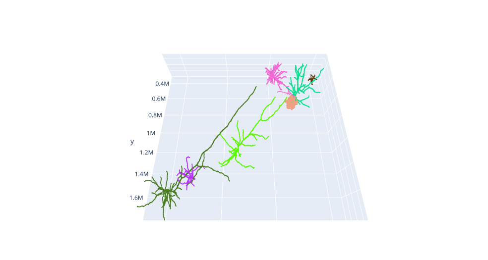

# H01 visualization tools

***

# Contents

## Jupyter Notebook files

Use [`h01_plotly_visualizer.ipynb` notebook](https://github.com/shandran/h01-volume/blob/main/notebooks/h01_plotly_visualizer.ipynb) to generate a 2D and 3D interactive views of one or more cells of interest from the H01 volume. Uses matplotlib and plotly visualization methods. See an example visualization below. Note that many cell meshes are enormous (1 GB) and may cause memory allocation issues on typical computer systems.

Use [`pyvista_decimate_mesh_astro_cell_bodies_h01.ipynb`](https://github.com/shandran/h01-volume/blob/main/notebooks/pyvista_decimate_mesh_astro_cell_bodies_h01.ipynb) to decimate meshes (default setting is 95%) of any cell meshes that you downloaded using the `h01_plotly_visualizer.ipynb` notebook. Note that large astrocytes can take multiple hours to decimate (up to 12+ hours), whereas less complex astrocytes and neurons typically take minutes to decimate on a typical laptop.

Use [`pyvista_mesh_decimation_h01_googlecolab.ipynb`](https://github.com/shandran/h01-volume/blob/main/notebooks/pyvista_mesh_decimation_h01_googlecolab.ipynb) to use Google Colab Pro (subscription required), if your local machine does not have the memory or computational power to decimate large meshes (e.g., astrocytes). A mesh requiring 12 hours on a standard machine only took 8 minutes of processing on Google Colab Pro with High-RAM option.

Use [`vtk_decimated_astro_meshes_h01.ipynb`](https://github.com/shandran/h01-volume/blob/main/notebooks/vtk_decimated_astro_meshes_h01.ipynb) to generate a 3D interactive render of decimated meshes using vtk and OpenGL viewer. There are a variety of rendering methods that help bring out more clarity of the astrocyte cell membrane, including gradient coloring and opacity settings. Use matplotlib colormaps to change color settings and modify the opacity levels, camera view settings, and gradient method (linear or exponential).

Use [`vtk_decimated_cell_meshes_bycelltype_h01.ipynb`](https://github.com/shandran/h01-volume/blob/main/notebooks/vtk_decimated_cell_meshes_bycelltype_h01.ipynb) to generate a 3D interactive render of decimated meshes using vtk and OpenGL viewer. Cells of interest are separated into four lists: neurons, astrocytes, microglia, and segments (partial and/or unidentified cell segments), allowing for custom opacity settings in the vtk renderer. An example from the Axon Whorl link in the H01 gallery is shown below, containing two pyramidal neurons with contacts in the whorl, 3 local astrocytes, and a microglia immediately next to the axon whorl.

